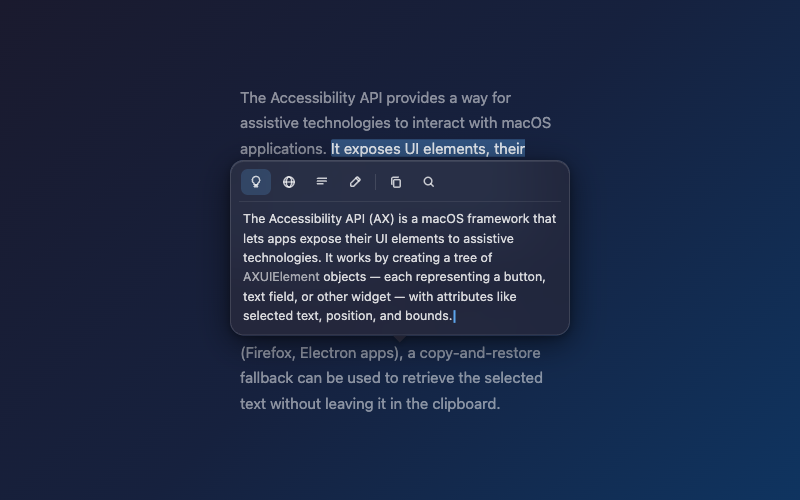

# Highlight Tools

A macOS menubar app that detects text selections and sends them to an LLM. Select text anywhere → a small popup appears with actions like Explain, Translate, Summarize, and Fix Grammar.

> **Demo project** — built as a learning exercise, not production software.



## What it does

- Detects text selection in any app (native apps via Accessibility API, browsers via copy fallback)
- Shows a minimal floating popup just above the selection
- Streams LLM responses inline
- Supports Ollama (local) and any OpenAI-compatible API

## Requirements

- macOS 13+
- Xcode 15+
- Accessibility permission (prompted on first launch)

## Build

```bash
brew install xcodegen
xcodegen generate
open HighlightTools.xcodeproj
```

Then build and run from Xcode.

## Stack

Swift + AppKit, no external dependencies.
